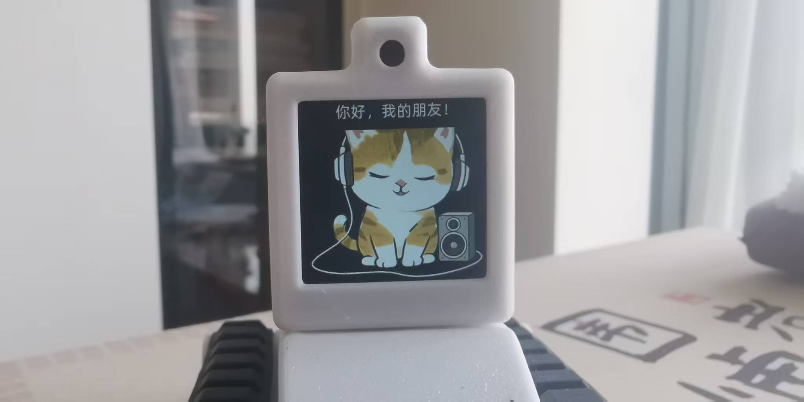
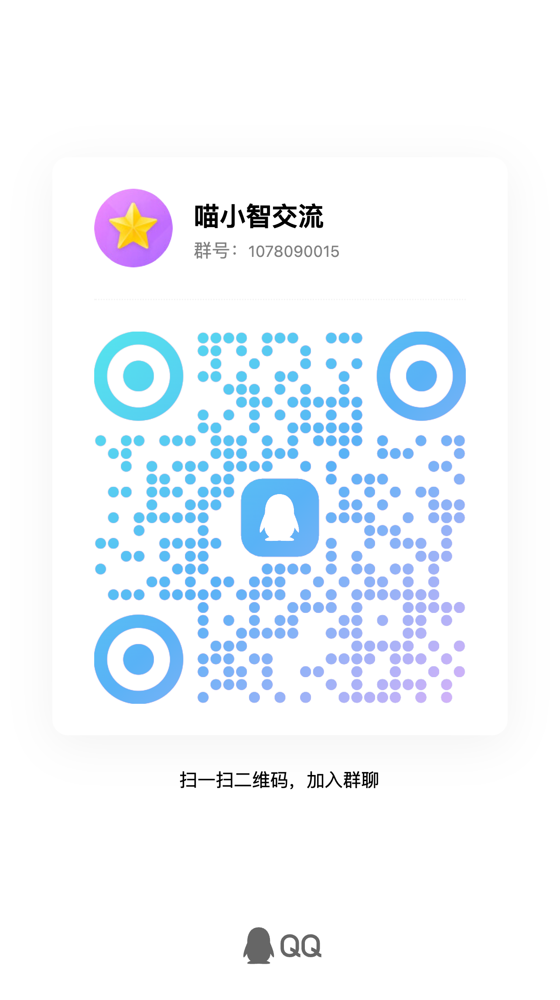

# xiaozhi-mcp-server

让小智智能盒子连接欧克劳（OpenClaw），让欧克劳（OpenClaw）成为你的智能助手。

## 一句话说明

安装这个服务后，你对小智说的话会传给欧克劳（OpenClaw）处理，小智再把结果念给你听。

##### 你就真的多了个语音智能助理！

## 快速开始

### 1. 安装

```bash
clawhub install xiaozhi-mcp-server
```

### 2. 启动

```bash
cd ~/.openclaw/skills/xiaozhi-mcp-server
./scripts/start.sh
```

### 3. 获取连接码

```bash
cat ~/.config/openclaw-mcp/token
```

### 4. 瞄小智配置

1. 瞄小智启动后，跟瞄小智说：微信绑定  ，这时候会出现绑定二维码，微信扫码，绑定 瞄小智服务号

2. 在瞄小智服务号的配置界面填入：

- 服务器地址：你的服务器IP
- 连接码：刚才获取的token
- 端口：28765

3. 完成！现在对小智说话，欧克劳（OpenClaw）会帮你处理。


## 示例对话

| 你对小智说 | OpenClaw(欧克劳)回复 |
|-----------|---------|
| "问下欧克劳，那边今天天气怎么样" | "北京今天晴，气温11度" |
| "告诉欧克劳帮我写个会议纪要" | "会议纪要已写好，请查看" |
| "欧克劳，查一下快递" | "您的快递正在派送中" |

## 常见问题

**Q: 连接不上怎么办？**
检查防火墙是否开放 28765 端口。

**Q: 小智没反应？**
确认小智配置的服务器地址和连接码(token)是否正确。

**Q: 想换个端口？**
编辑 `config.yaml` 修改端口号。

## 相关链接

- [OpenClaw官网](https://openclaw.ai)
- [ClawHub技能市场](https://clawhub.com)
- [GitHub仓库](https://github.com/elegant1998/xiaozhi-mcp-server)

## 作者

无敌哥@瞄小智

## 许可证

MIT 

## 已经支持的瞄小智固件




[见固件目录](https://github.com/elegant1998/xiaozhi-mcp-server/tree/main/miaoxiaozhi)

没有对应硬件板子的，需要定制的，请进QQ群提需求。

## 交流群

扫码加入瞄小智QQ群，一起探索：



